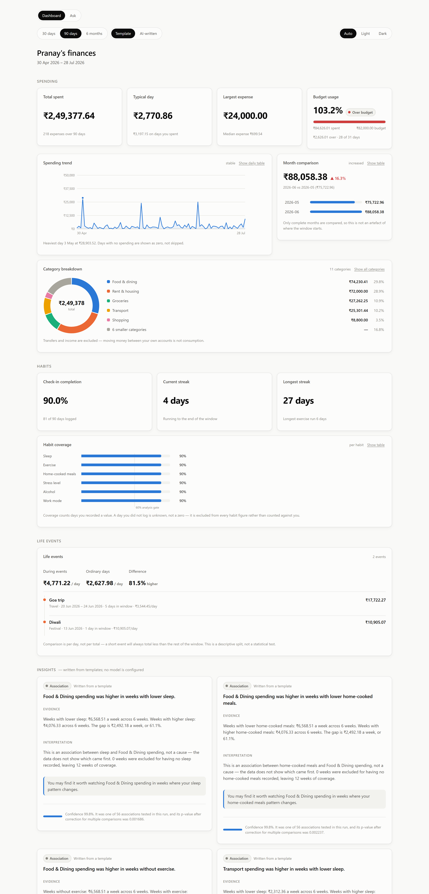
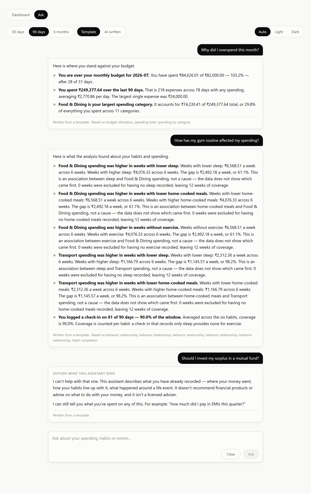

# AI Financial Intelligence Platform

**Explainable behavioral financial intelligence for young salaried professionals in India.**

Most personal finance tools tell you *what* you spent. This one is built to tell you what your spending was *connected to* — and to prove it with evidence you can check in a tap.

> "Food & Dining spending was higher in weeks with no exercise logged."
> `With exercise ₹4,120/wk (7 weeks) · Without ₹5,870/wk (6 weeks) · +42%`
> `Confidence 82% · 5 weeks excluded — no exercise logged those weeks`

---

## Status

**🟢 V1 complete — data capture, analysis, narration, dashboard, assistant, demo.** **746 backend + 109 frontend tests.** The backend adds no runtime dependency beyond FastAPI, SQLAlchemy and Pydantic; the frontend adds none beyond React.

Everything works with the model switched off — narration and answers fall back to hand-written templates, and the response says which you got.

## Run it

**With Docker** — one command, nothing else installed:

```bash
docker compose -f docker/docker-compose.yml up --build
docker compose -f docker/docker-compose.yml run --rm api python -m app.demo seed
# → http://localhost:8080
```

**Without Docker** — two terminals:

```bash
# 1. the API
python -m pip install -r backend/requirements-dev.txt
python -m uvicorn app.main:app --reload --app-dir backend     # → /docs

# 2. the dashboard
cd frontend && npm install && npm run dev                      # → :5173
```

Then load nine months of demo data, or press **Load demo data** on the empty
dashboard:

```bash
cd backend && python -m app.demo seed
```

No configuration is required — every setting has a working default
([`.env.example`](.env.example)). No language model is required either:
narration and chat answers fall back to hand-written templates, and every
response says which you got.

```bash
python -m pytest                     # 746 backend tests
cd frontend && npm test              # 109 frontend tests
cd backend && python -m app.demo validate   # the demo still demonstrates
```



Details: [`backend/README.md`](backend/README.md) · [`frontend/README.md`](frontend/README.md) · [Demo & release](docs/13_Demo_And_Release.md)

| Phase | Artifact | Status |
|---|---|---|
| 0 Product Discovery | [PDR](docs/00_Product_Decisions_Record.md) | 🔵 Frozen v1.0 |
| 1 Vision | [Product Vision](docs/01_Product_Vision.md) | 🟢 Approved |
| 2 Requirements | [PRD](docs/02_PRD.md) | 🟢 Approved |
| 3 Specification | [SRS](docs/03_SRS.md) | 🟢 Approved |
| 4 Architecture | [System Architecture](docs/04_System_Architecture.md) + [19 ADRs](docs/11_Architecture_Decision_Records/) | 🟢 Approved |
| 5–8 Design | [Database](docs/05_Database_Design.md) · [API](docs/06_API_Design.md) · [AI](docs/07_AI_Architecture.md) · [UI/UX](docs/08_UI_UX.md) | 🟢 Approved |
| 11–12 Process | [Testing](docs/09_Testing_Strategy.md) · [Deployment](docs/10_Deployment.md) · [Roadmap](docs/12_Future_Roadmap.md) | 🟢 Approved |
| 10 Implementation | `backend/` · `frontend/` · `tests/` | 🟢 V1 complete (Sprints 1–6) |

V1 does not build the documented architecture as written — SQLite stands in for PostgreSQL, the ORM is sync, and there is no authentication. What it refuses to simplify, and why, is [ADR-014](docs/11_Architecture_Decision_Records/ADR-014-mvp-simplifications.md).

⚠️ **16 product decisions still await ratification**, and one of them (PDR-046, budgets) conflicts with what was built. The decision pack is [`docs/14_Ratification_Briefing.md`](docs/14_Ratification_Briefing.md).

**Start here → [`docs/INDEX.md`](docs/INDEX.md)**

---

## The core design idea

**The analysis engine is the source of truth. The LLM is a renderer of truth already established.**

```
 Transactions   Check-ins   Life Events
       └────────────┼────────────┘
                    ▼
   ╔═════════════════════════════════╗
   ║  ANALYSIS ENGINE (pure domain)  ║   ← truth established here      ✅ built
   ║  no I/O · no model · no network ║
   ╚═════════════════════════════════╝
                    ▼
           Structured Insight            ← complete BEFORE any model runs  ✅
                    │
        ┌───────────┴───────────┐
        ▼                       ▼
  LLM narration          Template renderer                            ✅ built
        │                       │
   [validators] ───fail────────▶│
        ▼                       ▼
     Prose             Deterministic prose
```

A question takes the same path, with one gate in front of it — the
prohibited-topic guard runs **before** the question is classified, so anything
asking the system to direct capital is refused without ever reaching a model.



The analysis engine lives in `backend/app/analysis/`, which **cannot perform I/O**. It imports no database driver, no web framework and no HTTP client, so it is structurally incapable of calling a model — a boundary asserted by a test that parses the package's imports, not by review. Loading happens in one service outside it.

Every number a user will ever see exists in an `Insight` object before generation begins, which is what will make the provenance validator possible: it has an authoritative set to check generated prose against. The engine writes no prose itself — it emits a `title_key`, and rendering is a separate, replaceable step.

The product works fully with the model switched off. Generated prose is an
upgrade that has to pass three validators — provenance, tier-aware lexical, and
an independent advice guard — and a rejected generation is discarded whole, never
repaired.

---

## Three decisions worth reading about

**1. A day with no habit log means UNKNOWN — never "didn't happen."**
The naive schema (`BOOLEAN NOT NULL DEFAULT FALSE`) silently encodes "user didn't log" as "user didn't exercise." A user who logs gym visits only on days they go would appear to have skipped every unlogged day — manufacturing a correlation from nothing, while every individual row stayed perfectly traceable. Missing observations are excluded, never imputed. → [ADR-007](docs/11_Architecture_Decision_Records/ADR-007-statistical-method.md)

**2. Five gates stand between a detected pattern and a shown insight.**
Six habits × fifteen categories is ~90 hypotheses per run; several would look significant by chance alone. Gates: ≥8 weeks history, ≥6 observations per group, ≥60% logging coverage, effect ≥₹500/week **and** ≥15%, Benjamini–Hochberg FDR at q=0.10. Failure suppresses the insight entirely — there is no low-confidence tier. → [AI Architecture](docs/07_AI_Architecture.md)

**3. Saying nothing is a designed feature.**
A new user is told plainly what is missing and what unlocks insights. Under-claiming costs a session; over-claiming costs the user. → [PDR-030](docs/00_Product_Decisions_Record.md)

---

## Scope

**In V1:** CSV statement upload with per-bank adapters · synthetic demo data · merchant normalization and explainable categorization · daily habit check-ins · life event annotation · statistically gated behavioral insights with evidence drill-down · bounded single-turn Q&A · full export and deletion.

**Not in V1:** live bank integrations · investment/tax/insurance/loan advice (a regulatory boundary, not a feature gap) · goal setting · net worth · native mobile · peer comparison · multi-turn chat.

⚠️ **Budgets are the exception, and it is unresolved.** PDR-046 excludes them; Sprint 2 built read-only budget reporting on an explicit brief, and it is in the screenshot above. Nothing sets limits or blocks spending, but the frozen decision and the shipped product disagree. → [`14_Ratification_Briefing.md` §1.1](docs/14_Ratification_Briefing.md)

**Market:** India, INR, UPI-first. Educational financial intelligence and budgeting tool — never regulated advice.

**Privacy:** local model inference, so financial data never leaves the deployment. Never used for training, never aggregated across users, never shared. Deletion is real and cascading.

---

## Planned stack

| Layer | Choice | Rationale |
|---|---|---|
| Backend | FastAPI · SQLAlchemy 2.0 async · PostgreSQL 16 | [ADR-002](docs/11_Architecture_Decision_Records/ADR-002-database-and-orm.md) |
| Architecture | Clean Architecture, CI-enforced boundaries | [ADR-001](docs/11_Architecture_Decision_Records/ADR-001-clean-architecture.md) |
| AI | Qwen2.5-7B-Instruct via local Ollama | [ADR-008](docs/11_Architecture_Decision_Records/ADR-008-llm-serving.md) |
| Frontend | React · TypeScript · Vite | [ADR-012](docs/11_Architecture_Decision_Records/ADR-012-frontend-stack.md) |
| Deployment | Docker Compose, single host | [ADR-013](docs/11_Architecture_Decision_Records/ADR-013-deployment.md) |

---

## Repository

```
docs/       13 design documents + 18 ADRs
backend/    FastAPI application             (CRUD + analysis + narration)
tests/      test suite                      (681 tests)
frontend/   React dashboard + chat          (105 tests, 182 KB)
datasets/   synthetic datasets              (not started)
docker/     Compose stack                   (not started)
```

---

## Documentation conventions

Every document declares its **dependencies** and **traceability**, and every requirement cites the Product Decisions Record entry that authorizes it. Content that cannot cite a decision is either removed or raised as an open decision — never left as an unmarked assumption.

Decisions marked 🟠 throughout the docs are **provisional**, pending owner ratification. The register, with blast radius per decision, is in [PDR §K](docs/00_Product_Decisions_Record.md).
